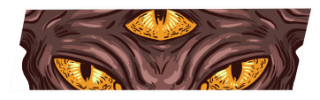
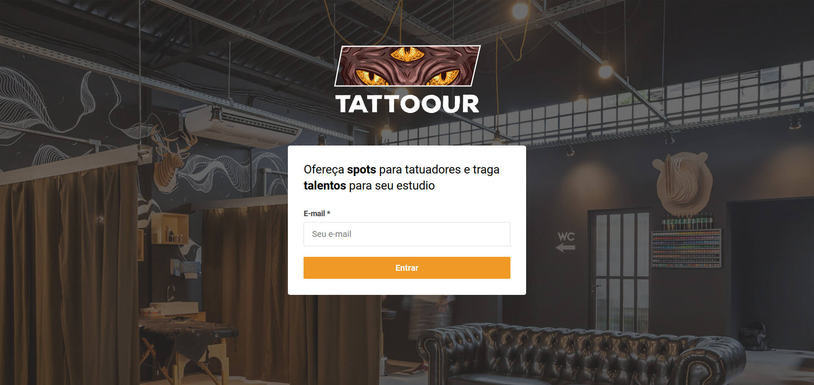
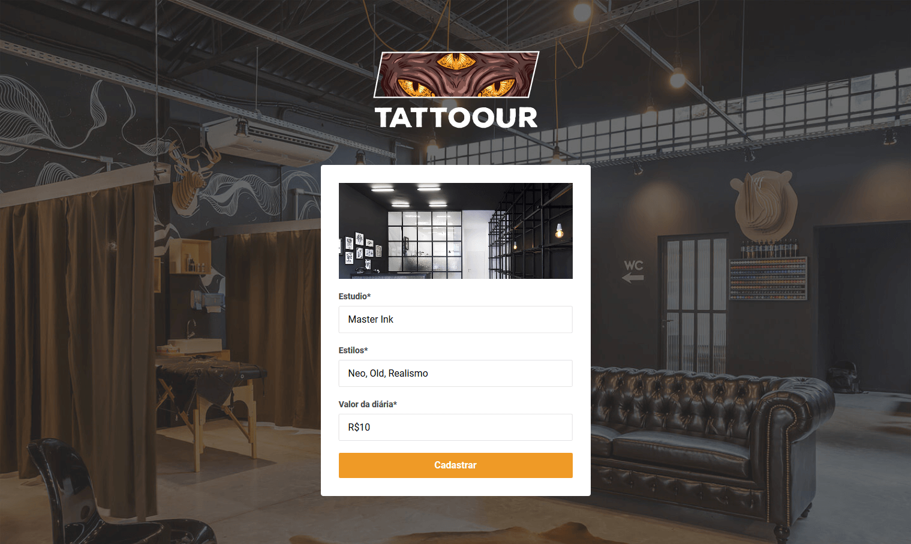
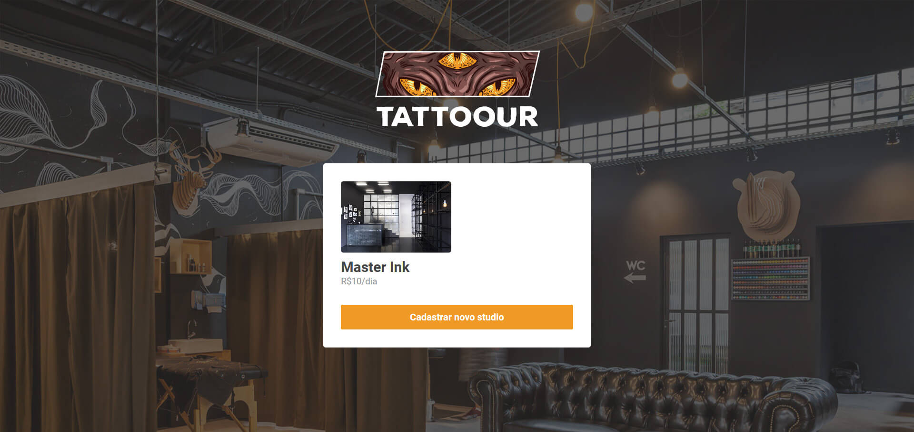

<p align="center">
  
</p>

# Tattoour

## O que é?

Um app e site para agendamento e reserva de salas para tatuar.

## Como funciona?

O usuário acessa o site via web ou mobile e escolhe uma sala com data e horário para que possa agendar e combinar com o dono da sala. O dono da sala possui acesso a um painel para controle das pessoas que estão interessadas em sua sala e edição/atualização de salas existentes atreladas a ele.

## Telas





## Como foi feito?

O projeto foi desenvolvido usando JavaScript, ao redor das bibliotecas React (Web), React Native(Mobile/App) e NodeJs + Express(back-end). É uma aplicação simples criada para treinar e relembrar alguns conceitos importantes ensinados durante o Bootcamp.

## Quero testar.

Perfeito, faça o clone do repositorio em sua máquina e rode os comandos:

Iniciando o servidor (backend):
```
cd backend //Para acessar a pasta do backend
yarn //Para instalar os pacotes e dependências
yarn dev //Para "ligar" o servidor
```

Iniciando o site (frontend):
```
cd frontend //Para acessar a pasta do frontend
yarn //Para instalar os pacotes e dependências
yarn start //Para iniciar a aplicação, é necessário que o backend esteja rodando para fazer as consultas
```

Iniciando o app (mobile):
```
cd mobile //Para acessar a pasta do frontend
yarn //Para instalar os pacotes e dependências
yarn start //Para iniciar o, é necessário que o backend esteja rodando para fazer as consultas. E ter um emulador nativo ou Expo para rodar
```
